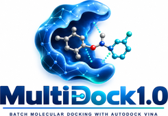

# MultiDock1.0

**Ligand Preparation & Molecular Docking**  
*Simple – Fast – Reliable*  

**Developer:** Nguyen Duc Tri Thuc  
**Affiliation:** Faculty of Pharmacy, Ton Duc Thang University  

> **For a healthier tomorrow.**



## Overview

**MultiDock1.0** is a graphical research workflow developed to simplify and automate ligand preparation and molecular docking for computer-aided drug discovery and medicinal chemistry research. It integrates ligand preparation, batch docking, docking-score extraction, ranking, and result management in a single user-friendly interface.

The ligand-preparation module accepts **SDF** structures and uses **RDKit** and the **Meeko Python API** to generate AutoDock-compatible **PDBQT** files. The workflow includes molecular structure validation, hydrogen handling, 3D-coordinate checking, preparation of AutoDock atom types/charges and rotatable bonds, and PDBQT validation.

Molecular docking is performed with **AutoDock Vina** as the docking engine. MultiDock1.0 automates docking of multiple ligands against a common receptor using user-defined search-space coordinates and Vina parameters. It then extracts the best Vina score, ranks compounds, and saves docking poses, logs, failed-ligand information, docking parameters, and CSV summaries.

**MultiDock1.0 is a workflow/automation tool; it does not introduce a new docking algorithm or scoring function.** Docking calculations and scoring are performed by AutoDock Vina.

## Main features

- Batch ligand preparation: **SDF → PDBQT**
- RDKit + Meeko integration
- PDBQT syntax validation
- Batch molecular docking using AutoDock Vina
- User-defined grid center and box dimensions
- User-defined exhaustiveness, energy range, number of modes, and CPU allocation
- Automatic extraction of the best Vina score
- Automatic ligand ranking
- Docking poses, per-ligand logs, summary CSV files, and failed-ligand reports
- Recording of docking parameters for reproducibility
- Graphical interface for medicinal-chemistry and virtual-screening workflows

## Requirements for running from source

- Python 3.11 recommended
- RDKit
- Meeko
- SciPy
- Gemmi
- Tkinter
- AutoDock Vina

Install the Python dependencies with:

```bash
python -m pip install -r requirements.txt
```

AutoDock Vina is a third-party docking engine and is **not included in this repository**. Install/download Vina from its official distribution and either place the appropriate executable beside the source/application or make it available on `PATH`.

## Run from source

```bash
python MultiDock1.0_Standalone.py
```

## Windows standalone build

Place the official `vina.exe` in the repository root before building, then run:

```text
BUILD_MultiDock1.0_STANDALONE.bat
```

The resulting executable is written to:

```text
dist\MultiDock1.0.exe
```

## Typical workflow

```text
SDF ligand library
      ↓
RDKit / Meeko preparation
      ↓
PDBQT ligand library
      ↓
AutoDock Vina batch docking
      ↓
Docking poses + logs
      ↓
Automatic score extraction
      ↓
Ranked CSV results
```

## Scientific use

MultiDock1.0 is intended for academic research and computational drug-discovery applications, including medicinal chemistry, structure-based virtual screening, hit prioritization, and molecular docking studies.

Vina scores are computational predictions and should not be interpreted as experimentally measured binding free energies. Users should validate the docking protocol (for example, by redocking an appropriate co-crystallized ligand where applicable) and experimentally verify biological conclusions when appropriate.

## Citation

If you use MultiDock1.0 in published research, please cite the archived MultiDock1.0 software release **and** the relevant AutoDock Vina publications. See [`CITATION.cff`](CITATION.cff).

**MultiDock1.0 v1.0.0**  
Nguyen Duc Tri Thuc  
Faculty of Pharmacy, Ton Duc Thang University  

DOI: https://doi.org/10.5281/zenodo.22798752

## Third-party software

MultiDock1.0 relies on third-party scientific software. See [`THIRD_PARTY_SOFTWARE.md`](THIRD_PARTY_SOFTWARE.md). Third-party components remain subject to their own licenses and citation requirements.

## License

The MultiDock1.0 source code in this repository is released under the MIT License. This license does not replace or modify the licenses of AutoDock Vina, RDKit, Meeko, SciPy, Gemmi, or other third-party components.

---

**MultiDock1.0 — For a healthier tomorrow.**
